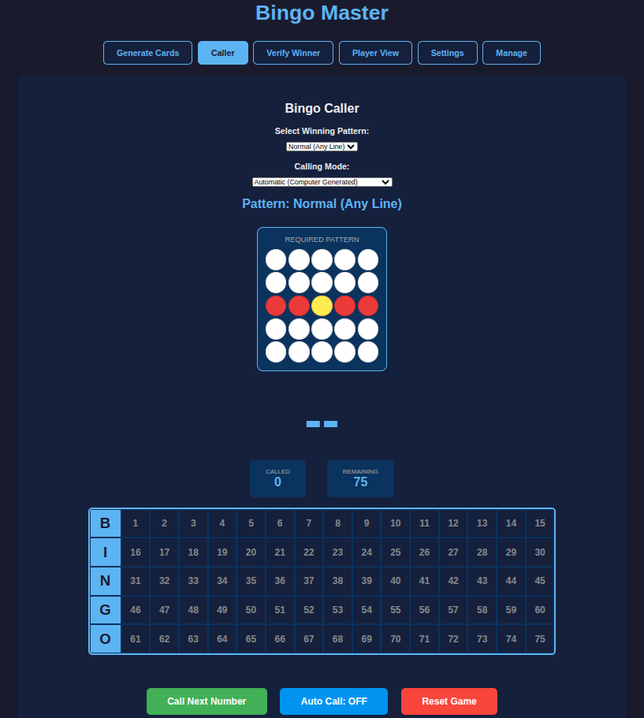
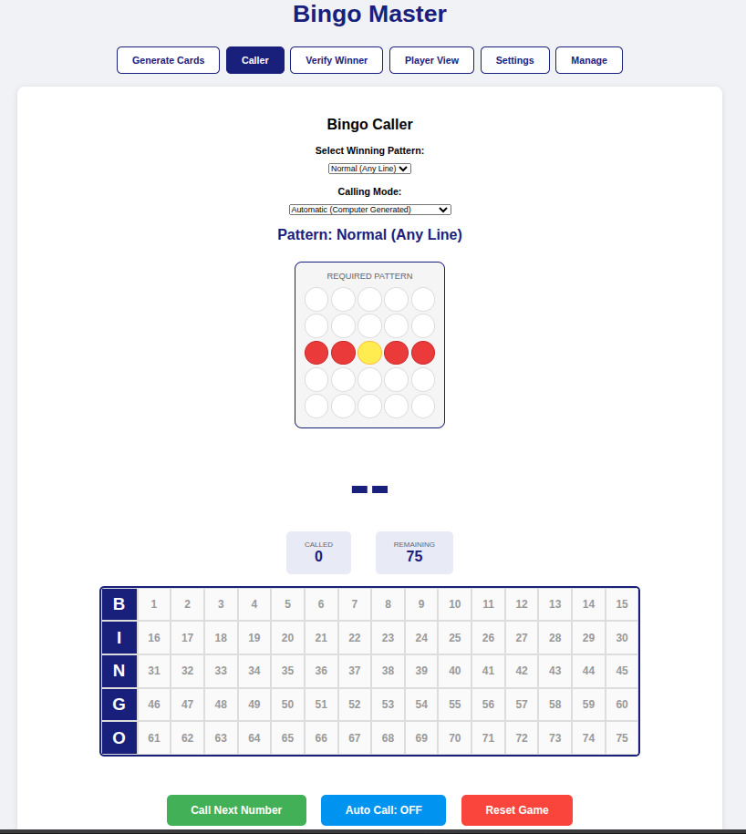
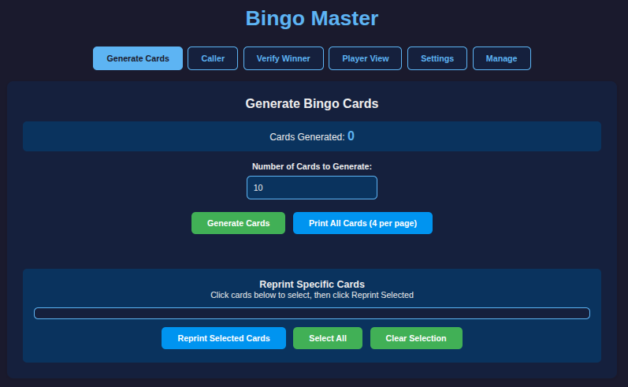
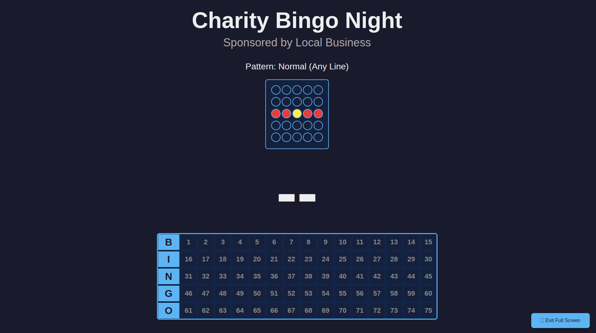
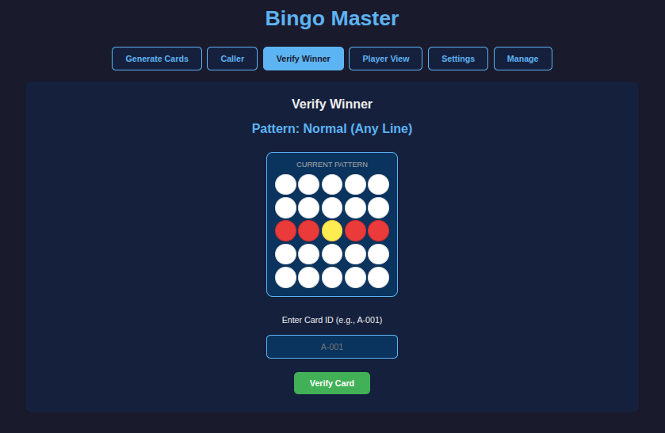
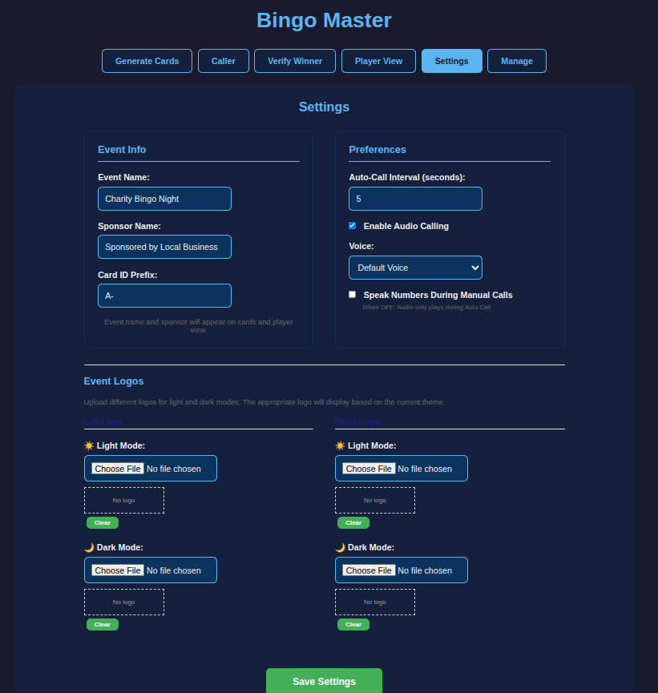

# Bingo Master

A complete, self-hosted bingo solution that runs entirely in your browser with no Internet connection required.

**🎮 Live Demo:** [Play Bingo Master Online](https://commputethis.github.io/Bingo_Master/bingo.html)

*Note: If you visit [https://commputethis.github.io/Bingo_Master/](https://commputethis.github.io/Bingo_Master/), click the link above to launch the caller.*

---

## 📸 Screenshots

| Dark Mode | Light Mode |
| --------- | ---------- |
|  |  |
| *Main caller interface in dark mode* | *Main caller interface in light mode* |

| Card Generator | Player View |
| ------------- | ----------- |
|  |  |
| *Generate and print bingo cards* | *Large-format player display* |

| Winner Verification | Settings |
| ------------------- | -------- |
|  |  |
| *Verify winning cards instantly* | *Customize your event* |

---

## Overview

Bingo Master is a fully-featured bingo management system designed for charity events, community gatherings, and bingo nights. It generates unique bingo cards, calls numbers, verifies winners, and displays game information - all running locally in your web browser.

## Quick Start (Online)

Want to try it out right now?

👉 **[Launch Bingo Master](https://commputethis.github.io/Bingo_Master/bingo.html)**

No download needed! The online version works exactly like the downloadable version. Your data is still stored locally in your browser.

## Features

### Card Management

- **Generate unique bingo cards** with customizable ID prefixes
- **Print 4 cards per page** on standard 8.5" x 11" paper
- **Reprint specific cards** as needed
- **Track card inventory** with generated count display
- **Export/Import** - Transfer cards and settings between computers

### Game Play Modes

- **Automatic Mode**: Computer generates random numbers
- **Manual Mode**: Click numbers on the board to call them (for use with physical bingo equipment)
- **Auto Call**: Configurable interval for automatic calling
- **Undo**: Remove last called number if entered by mistake

### Audio Calling

- **Text-to-speech** announces numbers aloud
- **Smart audio**: Only plays during Auto Call (configurable to speak during manual calls)
- **Voice selection**: Choose from available system voices
- **Clear pronunciation**: "B... 12" or "N... 34"

### Winner Verification

- **12 winning patterns**: Normal, 4 Corners, Outside Edge, Cover All, Inner Frame, Windmill, X, Plus, Checkerboard, Smiley Face, Martini Glass, Bow Tie
- **Visual pattern display** showing required spaces
- **Instant card verification** by ID
- **Fraud prevention** with unique card tracking

### Display Options

- **Dark mode** (default) and light mode
- **Player view** with current number and called history
- **Separate player window** for projection/display
- **Fullscreen support** with toggle button
- **Customizable event name and sponsor** on cards and displays
- **Optional logos** for event branding (left and right of header)
  - See [Logo Specifications](#logo-specifications) below

### Data Management

- **Export/Import** - Backup or transfer to another machine via JSON file
- **Local storage** - All data saved in your browser
- **No Internet required** after initial load (downloadable version)

## System Requirements

- Modern web browser (Chrome, Firefox, Edge, Safari)
- Computer with 4GB+ RAM recommended for large card sets
- Printer (for printing bingo cards)
- Optional: Projector or large screen for player view
- Optional: Speakers for audio calling

## Logo Specifications

### Display Sizes

| Location | Max Width | Max Height | Notes |
| - | - | - | - |
| Bingo Cards | 120px per logo | 60px | Positioned left/right above card grid |
| Player View Window | 200px per logo | 80px | Larger display for projection |
| Settings Preview | 150px | 100px | Thumbnail preview in settings panel |

### Recommended Upload Specs

- Format: PNG (with transparency recommended) or JPG
- Recommended Size: 200-400px width, proportional height
- Aspect Ratio: Wide/horizontal orientation works best
- File Size: Under 500KB per logo (stored in browser localStorage)
- Style: Simple, high-contrast logos work best for both dark and light modes

### Important Notes

- Logos are automatically scaled to fit while maintaining aspect ratio (object-fit: contain)
- Upload separate versions for Light Mode and Dark Mode for best visibility
- Logos are stored locally in your browser (base64 encoded) - they are not uploaded to any server
- Maximum recommended total storage: ~5MB for all logos combined (browser localStorage limit)

### Suggested Logo Dimensions

For best results across all displays, upload logos approximately:

- Width: 200-400 pixels
- Height: 100-200 pixels
- Transparent background: Recommended for seamless integration

This gives you flexibility while ensuring the logos look crisp when scaled down on cards and up in the player view.

## Installation Options

### Option 1: Use Online (Easiest)

Simply visit: **[https://commputethis.github.io/Bingo_Master/bingo.html](https://commputethis.github.io/Bingo_Master/bingo.html)**

Your data is stored in your browser's local storage just like the downloaded version.

### Option 2: Download for Offline Use

1. Download `bingo.html` from the repository
2. Double-click the file to open in your web browser
3. No installation required - works completely offline!

## Quick Start Guide

### Before Your Event

1. **Open Bingo Master**:
   - **Online**: Visit [https://commputethis.github.io/Bingo_Master/bingo.html](https://commputethis.github.io/Bingo_Master/bingo.html)
   - **Offline**: Double-click `bingo.html`

2. **Configure Settings** (Settings tab):
   - Enter your **Event Name**
   - Enter **Sponsor Name** (appears on cards)
   - Set **Card ID Prefix** (e.g., "A-", "GAME-")
   - Upload **logos** (optional - left and right sides)
   - Adjust **Auto-Call Interval** if needed
   - Configure **Audio** settings
   - Choose **Dark Mode** or **Light Mode**

3. **Generate Cards** (Generate Cards tab):
   - Enter number of cards needed
   - Click **Generate Cards**
   - Click **Print All Cards (4 per page)**
   - Distribute printed cards to players

4. **Export Backup** (Manage tab - recommended):
   - Click **Export All Data**
   - Save the `.json` file as backup

### During Your Event

#### Automatic Mode (Computer Calls Numbers)

1. **Open Caller** (Caller tab):
   - Select **Calling Mode: Automatic**
   - Select **Winning Pattern** from dropdown
   - Click **Call Next Number** or enable **Auto Call**

2. **Display for Players** (Player View Window):
   - **Opend in a New Window**
   - Drag window to projector/second screen
   - Click **Full Screen** button if desired

#### Manual Mode (Using Physical Bingo Caller)

1. **Open Caller** (Caller tab):
   - Select **Calling Mode: Manual**
   - Select **Winning Pattern**

2. **Call Numbers**:
   - When physical caller announces a number, click it on the board
   - Or use **Auto Call** with audio if desired

3. **Undo if needed**:
   - Click **Undo Last Call** if wrong number entered

4. **Display for Players** (same as automatic mode)

### Verify Winners

1. Go to **Verify Winner** tab
2. Enter **Card ID** when player calls bingo
3. Click **Verify Card**
4. System confirms if pattern is complete

### After Your Event

- **Export Data** (Manage tab) to save for next time
- **Clear All Data** when ready to start fresh

## Calling Modes Explained

### Automatic Mode

- Computer generates random numbers
- Use "Call Next Number" button or Auto Call
- Audio speaks numbers (if enabled)

### Manual Mode

- Click numbers directly on the board
- Use with physical bingo cage/caller
- Audio only speaks if "Speak Manual Calls" setting is ON
- Undo button available for mistakes

## Audio Settings

| Setting | Description |
| ------- | ----------- |
| Enable Audio Calling | Master on/off switch for all audio |
| Voice | Select system voice to use |
| Speak Manual Calls | When OFF: Audio only during Auto Call. When ON: Audio for all calls |

**Default**: Audio ON, Speak Manual Calls OFF (audio only during auto-call)

## Transferring to Another Computer

### Export (Source Computer)

1. Go to **Manage** tab
2. Click **Export All Data**
3. Save the `.json` file

### Import (Destination Computer)

1. Copy the `.json` file to the new computer
2. Open Bingo Master (online or offline version)
3. Go to **Manage** tab
4. Click **Import Data** and select the `.json` file
5. Confirm to replace current data

## Printing Tips

- Use **Portrait orientation** (cards print 2x2 = 4 per page)
- **Card stock** recommended for durability
- **Color printing** optional - works in grayscale
- Each card shows: Event Name, Sponsor, Card ID, and bingo grid
- Standard 8.5" x 11" paper

## Winning Patterns

| Pattern | Description |
| ------- | ----------- |
| Normal | Any horizontal, vertical, or diagonal line |
| 4 Corners | All four corner spaces |
| Outside Edge | Perimeter of the card |
| Cover All | Every space marked |
| Inner Frame | 3x3 center square |
| Windmill | Windmill shape pattern |
| X | Both diagonals |
| Plus | Center row and column |
| Checkerboard | Alternating pattern |
| Smiley Face | Eyes and smile pattern |
| Martini Glass | Classic martini shape |
| Bow Tie | Hourglass bow tie shape |

## Data Storage

All data is stored locally in your browser using LocalStorage:

- Generated cards
- Game history (called numbers)
- Settings (event name, sponsor, audio preferences, etc.)
- Logos (if uploaded)
- Dark/light mode preference

**Important**: Clearing browser data will delete all cards and history. Use **Export** to create backups!
**Note for Private/Incognito Mode**: Data may not persist between sessions in private browsing mode.

## Troubleshooting

### Cards not printing correctly?

- Ensure print margins are set to "Minimum" or "None"
- Disable "Print headers and footers" in browser print settings
- Try Chrome or Edge for best print compatibility

### Player view not updating?

- Check that LocalStorage is enabled in browser
- Refresh the player view window
- Ensure both windows are from the same browser instance

### Lost all my cards?

- Check if you exported a backup (Manage tab)
- Data may have been cleared by browser cleanup
- Regular exports recommended

### Fullscreen not working?

- Some browsers require user interaction before allowing fullscreen
- Try clicking the board first, then the fullscreen button

### Audio not working?

- Check that browser allows audio playback
- Verify "Enable Audio Calling" is checked in Settings
- Try selecting a different voice

## Browser Compatibility

| Browser | Support Level |
| ------- | ------------ |
| Chrome | ✅ Full support |
| Firefox | ✅ Full support |
| Edge | ✅ Full support |
| Safari | ✅ Full support |
| Internet Explorer | ❌ Not supported |

## Keyboard Shortcuts

- **ESC**: Exit fullscreen

## Source Code

View the source code or contribute on GitHub:  
[https://github.com/commputethis/Bingo_Master](https://github.com/commputethis/Bingo_Master)

## License

MIT License — See [LICENSE](LICENSE) for details.

Copyright (c) 2026 David Prows

---

**Happy Bingo Calling!**
